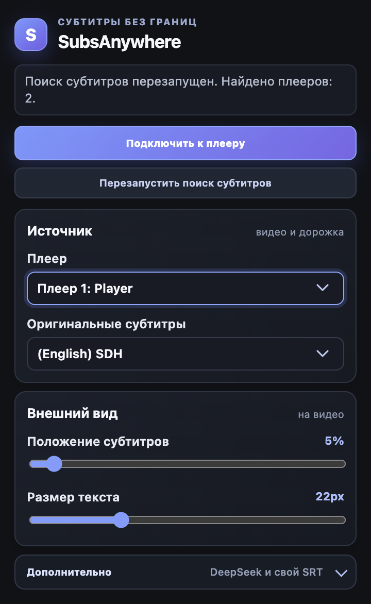
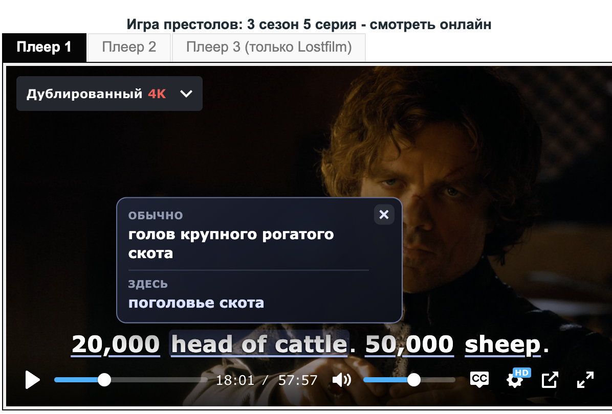

# SubsAnywhere

<p align="center">
  <strong>Оригинальные субтитры и перевод слов прямо в видеоплеере.</strong><br>
  Расширение Chrome для изучения английского по видео на сайтах с HTML5-плеером.
</p>

<p align="center">
  
  
  
  
</p>

> SubsAnywhere подключается к видеоплееру на открытой странице, показывает выбранные оригинальные субтитры и позволяет нажать на слово или выражение, чтобы увидеть перевод через DeepSeek.

## Что умеет

- Находит HTML5-видеоплееры, в том числе внутри фреймов страницы.
- Показывает одну выбранную оригинальную дорожку субтитров поверх видео.
- Размечает в текущей реплике слова и устойчивые выражения для перевода по клику.
- Даёт два перевода: обычные варианты и значение именно в текущем контексте.
- Позволяет добавить свой файл субтитров в формате SRT.
- На YouTube автоматически скачивает готовые китайские субтитры через локальный сервер, добавляет пиньинь над каждой строкой и подключает их как SRT.
- По отдельной кнопке скачивает только аудио и создаёт собственные китайские субтитры локальным FunASR.
- Поддерживает UTF-8 и Windows-1251, файлы до 5 МБ.
- Позволяет менять положение и размер субтитров, а для SRT — вручную настроить смещение и скорость.
- Сохраняет выбор плеера, дорожки и внешний вид отдельно для каждой страницы.
- После смены дорожки в плеере умеет заново найти субтитры по кнопке **«Перезапустить поиск субтитров»**.

## Скриншоты

### Окно расширения

Выбор плеера и оригинальной дорожки, настройка положения и размера субтитров.

<p align="center">
  
</p>

### Перевод прямо в плеере

Нажмите на слово или выражение в субтитрах — расширение покажет обычный перевод и значение в текущем контексте.



## Как это выглядит в работе

1. Откройте страницу с видео и запустите ролик.
2. Нажмите иконку **SubsAnywhere** в Chrome.
3. Нажмите **«Подключить к плееру»** и разрешите доступ к сайту.
4. Выберите плеер и оригинальную дорожку.
5. Сохраните API-ключ DeepSeek и выберите модель.
6. Нажмите на подчёркнутое слово или выражение в субтитрах.

Над фрагментом появится подсказка:

- **Обычно** — 2–3 распространённых варианта перевода.
- **Здесь** — короткий перевод именно в текущей реплике.

Подсказка закрывается крестиком или повторным нажатием на тот же фрагмент.

## Свой SRT

Если на сайте нет нужной встроенной дорожки:

1. Откройте раздел **«Дополнительно»** в окне расширения.
2. В блоке **«Свой SRT»** нажмите **«Добавить SRT»**.
3. Выберите файл оригинальных субтитров.
4. При необходимости настройте смещение и скорость в блоке **«Ручная синхронизация»**.

## Локальные субтитры для YouTube

Локальный сервер работает только на `127.0.0.1:43817`. Перед открытием YouTube запустите его из папки проекта:

```bash
npm run local-server
```

Нужны установленные `yt-dlp`, `ffmpeg` и готовое локальное окружение FunASR из скилла `video-url-to-subtitles`:

```text
~/.hermes/venvs/video-url-to-subtitles/bin/python
```

После открытия окна расширения на YouTube:

1. Сервер проверит и скачает готовую китайскую дорожку `zh-Hans`, если она есть.
2. Расширение сохранит её локально как SRT: пиньинь отображается основной строкой, а связанные с ним иероглифы — ниже. Нажатие на пиньинь переводит всю исходную китайскую фразу одним запросом и показывает полный перевод с кратким словарём `пиньинь — русский`.
3. Кнопка **«Создать свои субтитры»** всегда доступна, даже если готовая дорожка уже найдена.
4. Распознавание начинается только после нажатия кнопки. Сервер скачивает MP3-аудио, а не видео, затем запускает FunASR.
5. Окно расширения можно закрыть: работа продолжится на локальном сервере. При следующем открытии готовая дорожка подключится автоматически.

Файлы сохраняются в `~/Downloads/SubsAnywhere/<video-id>/`. Названия файлов состоят только из английских слов и ID видео:

```text
youtube-<video-id>-youtube.srt
youtube-<video-id>-audio.mp3
youtube-<video-id>-generated.srt
youtube-<video-id>-generated.txt
youtube-<video-id>-generated.timestamps.md
```

## DeepSeek и приватность

Для перевода по клику нужен собственный API-ключ DeepSeek. Он хранится локально в расширении и не передаётся сайту с видео.

В DeepSeek уходит только текущая реплика на экране — не более 500 символов. Полный файл субтитров не отправляется.

Чтобы контролировать расходы, расширение ограничивает работу перевода:

- один запрос одновременно;
- не менее 750 мс между запросами;
- одинаковая реплика не отправляется повторно;
- кэш до 80 реплик;
- до 120 запросов за одну загрузку страницы;
- ответ до 800 токенов;
- режим размышлений модели выключен.

## Ограничения

- Расширение работает с обычным HTML5-элементом `<video>` и текстовыми дорожками субтитров.
- Субтитры, которые навсегда «впаяны» в изображение видео, прочитать нельзя.
- Перевод по клику требует API-ключа DeepSeek.

## Установка для разработки

```bash
git clone git@github.com:niiikkid/SubsAnywhere.git
```

1. Откройте `chrome://extensions`.
2. Включите **Режим разработчика**.
3. Нажмите **Load unpacked / Загрузить распакованное расширение**.
4. Выберите папку проекта.

После изменений нажмите **Reload** у расширения в `chrome://extensions`, затем обновите страницу с видео и снова подключитесь к плееру. ZIP создавать не нужно.

## Проверка

Требуется актуальная версия Node.js.

```bash
npm test
npm run check
```

## Технологии

- Chrome Extension Manifest V3
- JavaScript (ES modules)
- Chrome APIs: `scripting`, `storage`, `activeTab`
- DeepSeek Chat Completions API
- Локальный Python-сервер, `yt-dlp`, FFmpeg и FunASR SenseVoiceSmall

---

Проект создан для личного изучения английского по видео.
